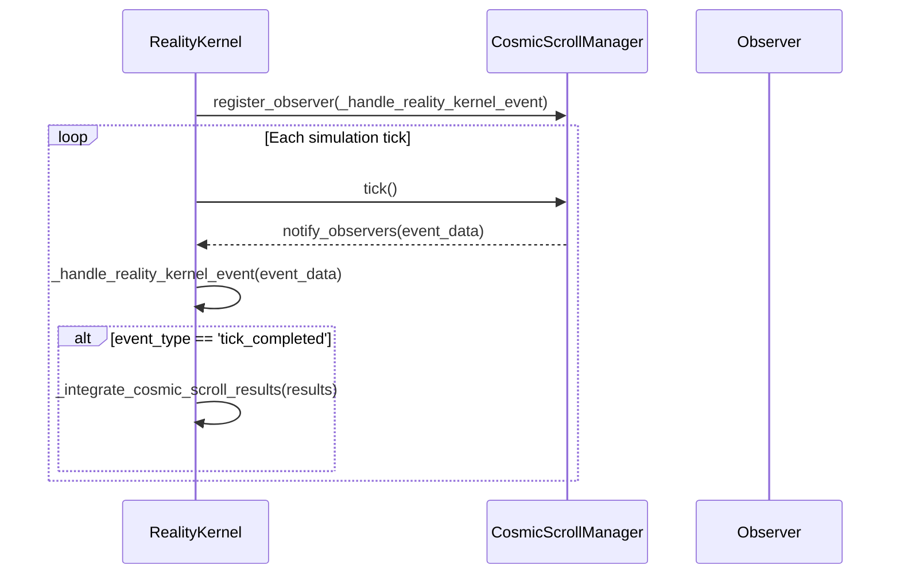
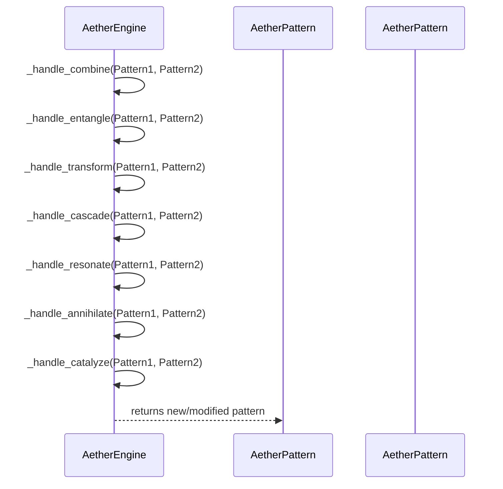
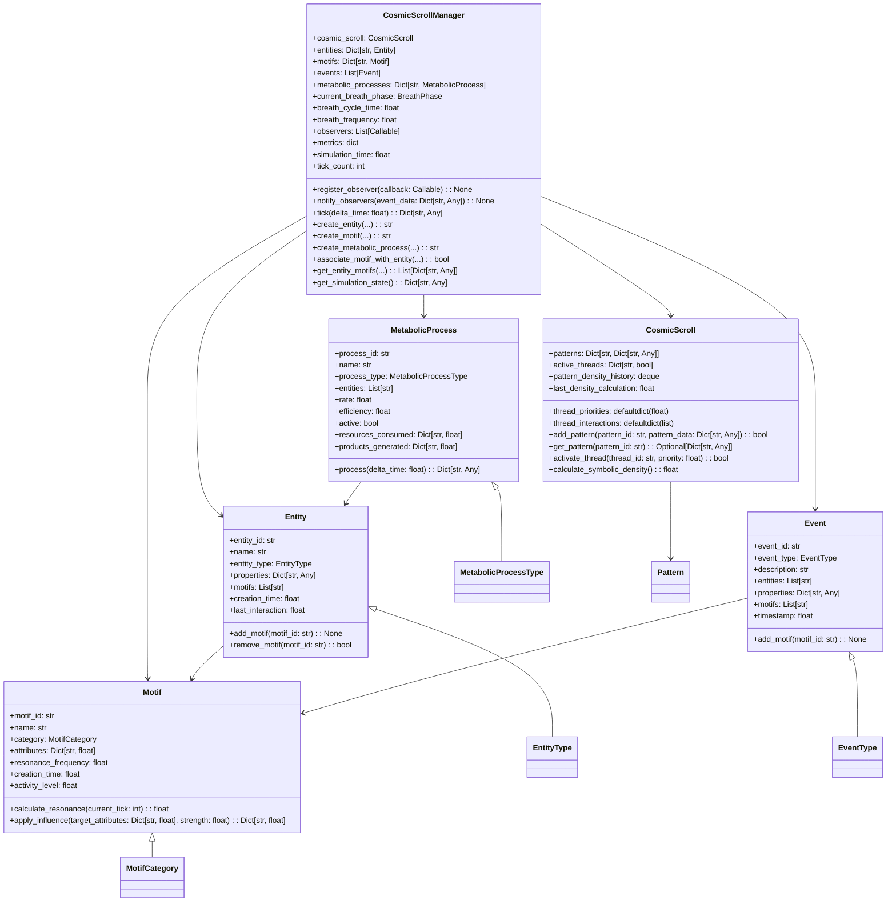
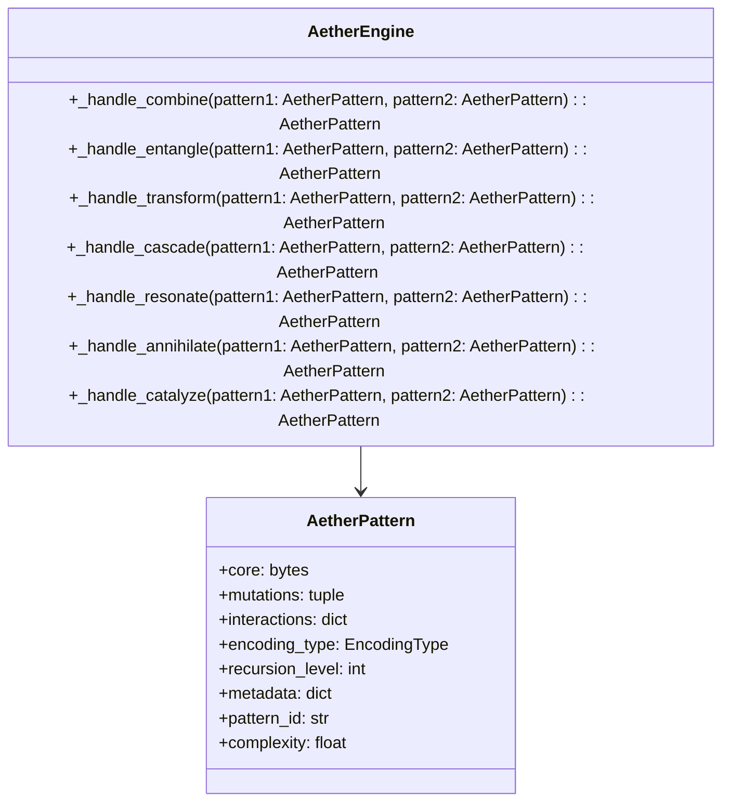

<p align="center">
  <a href="" rel="noopener">
 </a>
</p>

<h1 align="center">🌌 Loom Ascendant Cosmos</h1>
<h3 align="center">Genesis Cosmos Engine — Recursive Reality Simulation Framework</h3>

<div align="center">

[]()
[](/LICENSE)
[]()
[]()

</div>

---

<p align="center">
    <strong>A revolutionary recursive cosmological simulation framework implementing a seven-layer architecture where each layer both causes and is caused by others through controlled feedback loops. This system simulates complete universes with conscious agents, ethical physics, and paradox-to-entropy conversion.</strong>
    <br><br>
    <em>"The Genesis Cosmos Engine represents a comprehensive framework for creating worlds that are ontologically complete within their recursive context."</em>
    <br>
</p>

## 📝 Table of Contents

- [🌟 Theoretical Foundation](#theoretical-foundation)
  - [Genesis Framework Overview](#genesis-framework)
  - [Planetary Implementation Framework](#planetary-framework)
- [🏗️ System Architecture](#system-architecture)
- [🔄 Simulation Flow](#simulation-flow)
- [💫 Core Principles](#core-principles)
- [🚀 Getting Started](#getting_started)
- [📊 System Components](#components)
- [🔬 Physics Implementation](#physics)
- [🎯 Usage Examples](#usage)
- [🛠️ Built Using](#built_using)
- [👥 Authors](#authors)
- [📚 Documentation](#documentation)

---

## 🌟 Theoretical Foundation <a name="theoretical-foundation"></a>

The Loom Ascendant Cosmos is built upon two foundational theoretical frameworks that define the philosophical and technical principles underlying the entire system.

### 🔮 Genesis Framework Overview <a name="genesis-framework"></a>

The **Genesis Cosmos Engine** represents a recursive architectural framework for simulating causally-coherent universes. This is not merely symbolic or metaphorical—this framework establishes a theoretical foundation for the actual implementation of recursive cosmological systems.

#### 🎯 Core Axioms

1. **🔄 Recursive Causality**: Every layer both causes and is caused by other layers in controlled feedback loops
2. **🌬️ Breath as Synchronization**: All systems require synchronized oscillatory cycles to maintain coherence  
3. **🧠 Topological Memory**: Memory functions as a deformation of the system's state space rather than discrete storage
4. **⚖️ Ethical Tensors**: Moral considerations exert actual force vectors within the system
5. **� Paradox as Entropy Source**: Logical contradictions generate usable entropy rather than causing system failure
6. **🎯 Volition as First-Class Force**: Conscious intent functions as a fundamental force comparable to gravity or electromagnetism

#### 🏗️ Seven-Layer Architecture Stack

The Genesis Cosmos Engine is structured as a seven-layer stack with bidirectional information flow:

1. **⏰ Timeline Engine** - Chronological substrate with breath synchronization
2. **⚛️ Quantum & Physics Base** - Fundamental physics with ethical tensors  
3. **🌊 Aether Layer** - Procedural matter/energy encoding as interpretable patterns
4. **🌌 Universe Engine** - Cosmic evolution and structure formation
5. **🪐 AetherWorld Layer** - Planetary/habitat-scale environment blueprints
6. **🖼️ World Renderer** - Environment actualization
7. **🧠 Simulation Engine** - Conscious agent interface

### 🪐 Planetary Implementation Framework <a name="planetary-framework"></a>

The **Planetary Framework** provides the comprehensive technical specifications for implementing universe-scale reality simulation at the scale and fidelity of our observable universe.

#### 🌌 Universal Parameters

- **Simulation Boundary**: Configurable (Looping/Bounded/Infinite)
- **Galaxy Count**: 10¹² (comparable to observable universe)
- **Star Systems**: 10¹¹ per galaxy average
- **Habitable Planets**: ~10¹² (0.1% of total planetary bodies)
- **Intelligent Civilizations**: 10⁶ technologically advanced civilizations
- **Unique Species**: 10⁸ across all planets
- **Distinct Biomes**: 10⁶ ecosystem types

#### 🔬 Technical Implementation

The system maintains **consistent physics across all scales** while implementing optimization techniques:

- **Multi-Scale Physics Engine**: From quantum to galactic motion
- **Level of Detail Management**: Dynamic resolution scaling
- **Focus Area Granularity**: Enhanced detail where conscious observers are present
- **Background Approximation**: Efficient simulation of unobserved regions
- **Reality Interface System**: Full sensory input channels and neural interface architecture

---

## 🔄 Simulation Flow <a name="simulation-flow"></a>

The following diagrams illustrate the complex interaction patterns and data flow within the Genesis Cosmos Engine:

### System Interaction Flow



### Aether Pattern Processing Flow



### Cosmic Scroll Data Architecture



### Aether Pattern System Architecture  



---

## 💫 Core Principles <a name="core-principles"></a>

### 🔄 Recursive Architecture Patterns

**Observer Pattern Implementation**: All engines register as observers with bidirectional event flow:

```python
timeline.register_observer(universe._handle_temporal_event)
```

**Breath Synchronization**: Critical system-wide coherence mechanism:

- All operations align to `BreathPhase` enum cycles
- Master oscillator coordinates temporal coherence
- Phase relationships prevent recursive divergence

**Conservation Laws**: Fundamental constraints across all system layers:

- **Energy Conservation**: Total energy preserved across transformations
- **Information Conservation**: Data integrity maintained through all processes  
- **Ethical Weight Conservation**: Moral considerations quantified and preserved
- Exception handling via `ConservationError` when violations detected

### 🌊 Pattern-Based Reality Encoding

Everything in the system is encoded as `AetherPattern` structures:

```python
@dataclass
class AetherPattern:
    core: bytes                    # Immutable essence
    mutations: tuple              # Evolution pathways
    interactions: dict           # Combination rules
    recursion_level: int        # Modification depth
    encoding_type: EncodingType # BINARY/SYMBOLIC/VOXEL/GLYPH/QUANTUM/FRACTAL/WAVE
```

**Critical Design Principle**: Patterns are **interpretable code, not rendered objects** - they define procedural behavior rather than static assets.

### 🌀 Paradox Resolution System

Instead of treating logical contradictions as system failures, the Genesis Engine transforms them into usable entropy:

- **Detection Types**: Temporal, Causal, Ethical, Physical paradoxes
- **Resolution Deadline**: 3 breath cycles per Genesis Framework constraints  
- **Entropy Conversion**: Contradictions become thermodynamic energy sources
- **Containment**: Paradoxes isolated to prevent system-wide effects

---

## 🏁 Getting Started <a name="getting_started"></a>

### Prerequisites

**System Requirements**:

- Python 3.9+ with NumPy, SciPy, Matplotlib
- Memory: 16GB+ recommended for full simulation
- Storage: 100GB+ for comprehensive pattern libraries
- CPU: Multi-core processor (8+ cores recommended)

**Conceptual Prerequisites**:

- Understanding of recursive systems and feedback loops
- Basic quantum mechanics and thermodynamics concepts
- Familiarity with observer pattern and event-driven architectures

### Quick Start

1. **Clone the Repository**:

```bash
git clone https://github.com/calisweetleaf/Loom-Ascendent-Cosmos.git
cd Loom-Ascendent-Cosmos
```

2. **Environment Setup**:

```bash
pip install -r requirements.txt
python python_doctor.py  # System diagnostic and configuration
```

3. **Initialize Genesis Cosmos**:

```python
from reality_kernel import RealityKernel

# Create reality kernel with default parameters
kernel = RealityKernel()
kernel.initialize()

# Start simulation with conscious observer
kernel.run_simulation(duration=1000, observer_mode=True)
```

4. **Basic Pattern Interaction**:

```python
from aether_engine import AetherEngine, AetherPattern

# Create aether engine
aether = AetherEngine()

# Generate basic patterns
pattern_a = aether.generate_pattern(encoding_type='SYMBOLIC', complexity=0.7)
pattern_b = aether.generate_pattern(encoding_type='QUANTUM', complexity=0.5)

# Combine patterns with ethical weighting
result = aether.combine_patterns(pattern_a, pattern_b, ethical_weight=0.8)
```

### Development Workflow

**Build and Run**:

```bash
# Main simulation entry point
python main.py

# Reality kernel orchestration
python -c "from reality_kernel import RealityKernel; RealityKernel().initialize().run_simulation()"
```

**Testing**:

```bash
# Run comprehensive system tests
python -m pytest tests/ -v

# Physics conservation validation
python test_conservation_laws.py

# Paradox resolution testing
python test_paradox_engine.py
```

---

*This README provides the foundational understanding necessary to comprehend the scope and complexity of the Genesis Cosmos Engine. The theoretical frameworks presented here are not abstract concepts but concrete implementation specifications for a complete recursive reality simulation system.*

*Further sections detailing system components, physics implementation, usage examples, and technical architecture will follow as we continue building this comprehensive documentation.*
